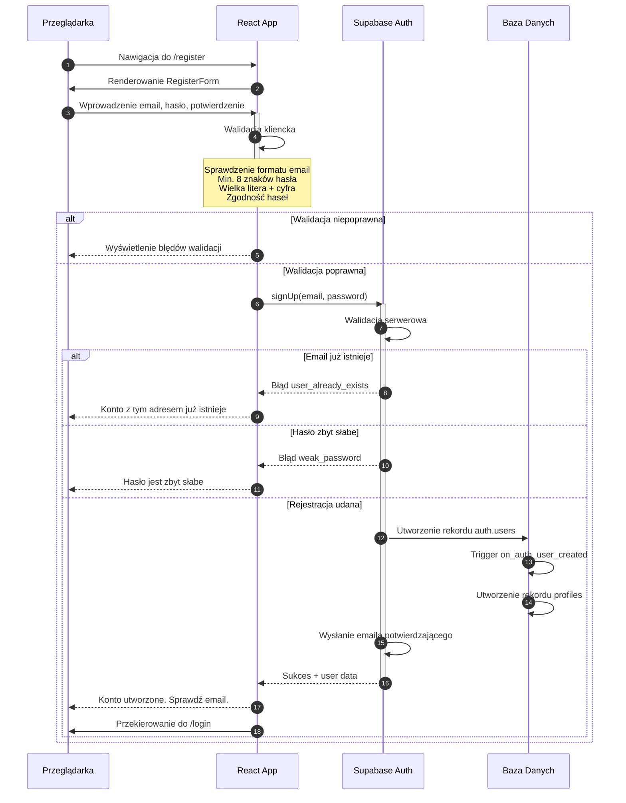
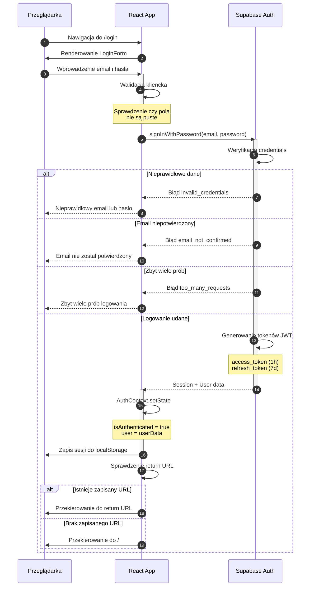
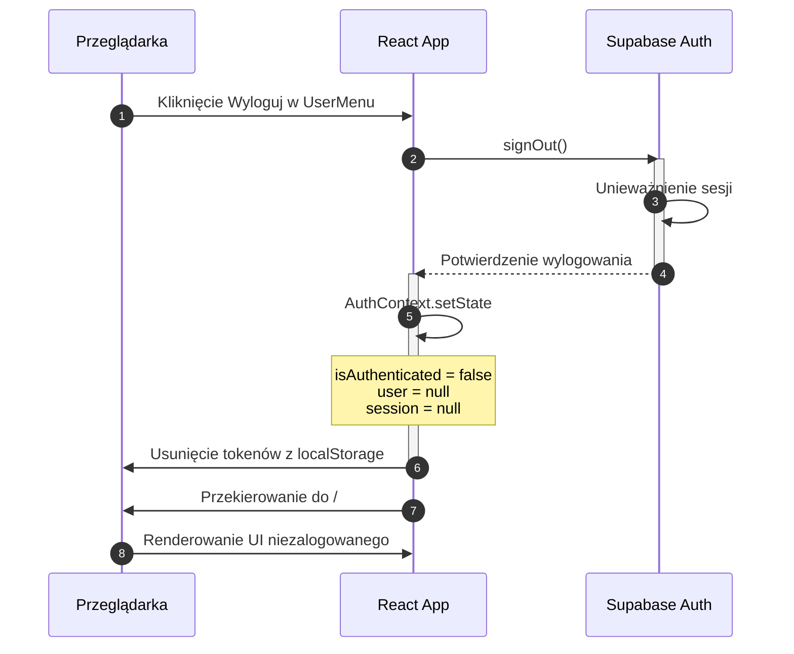
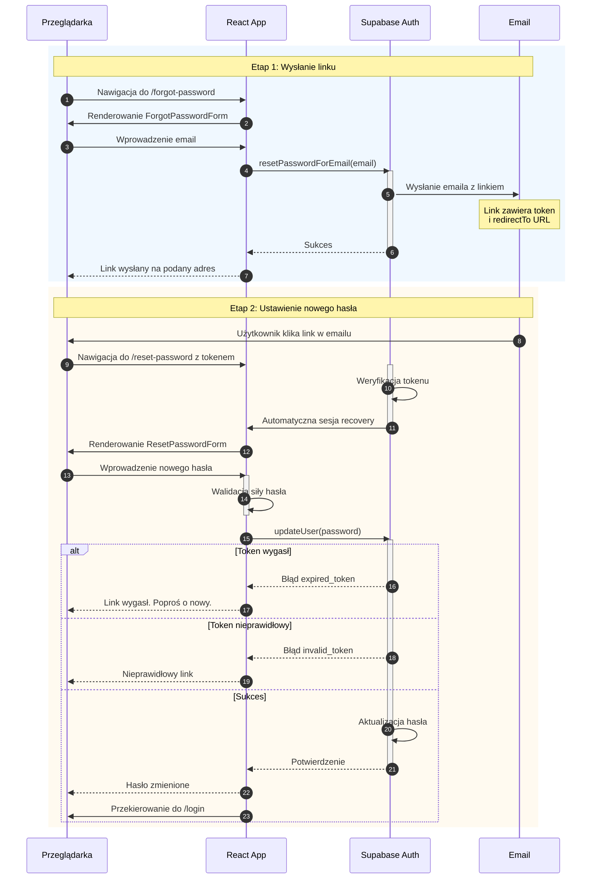
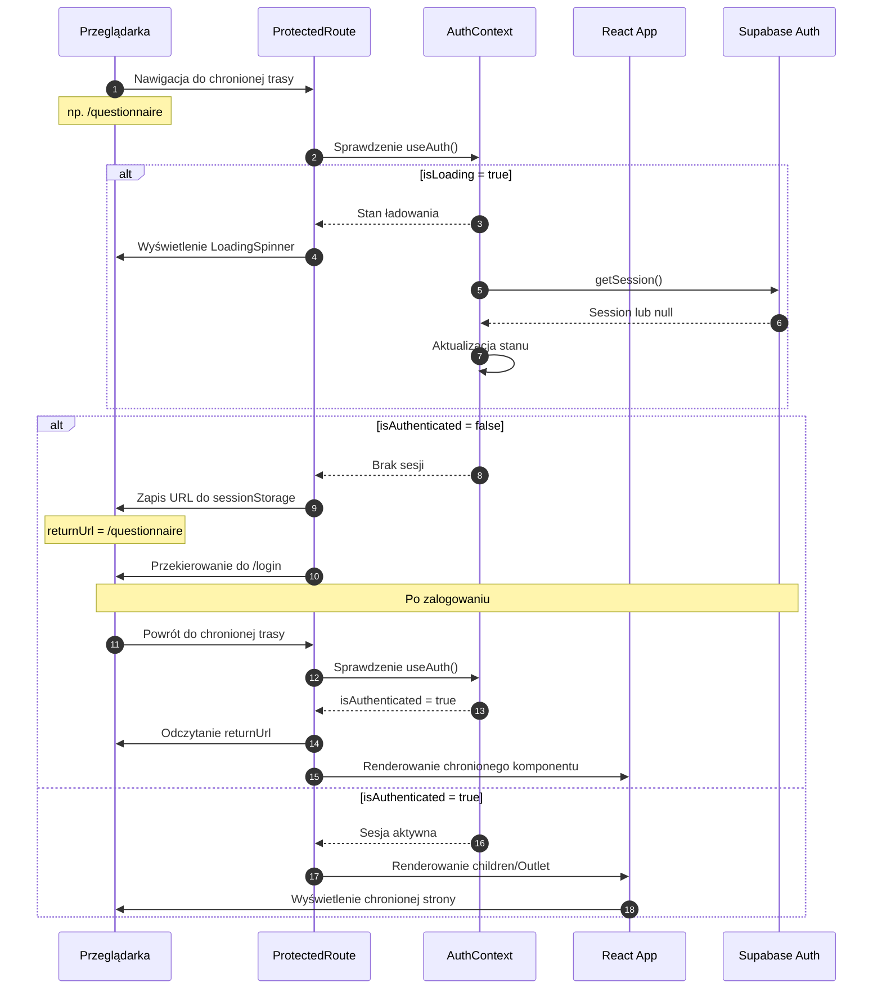
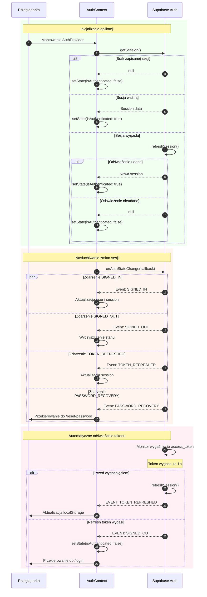
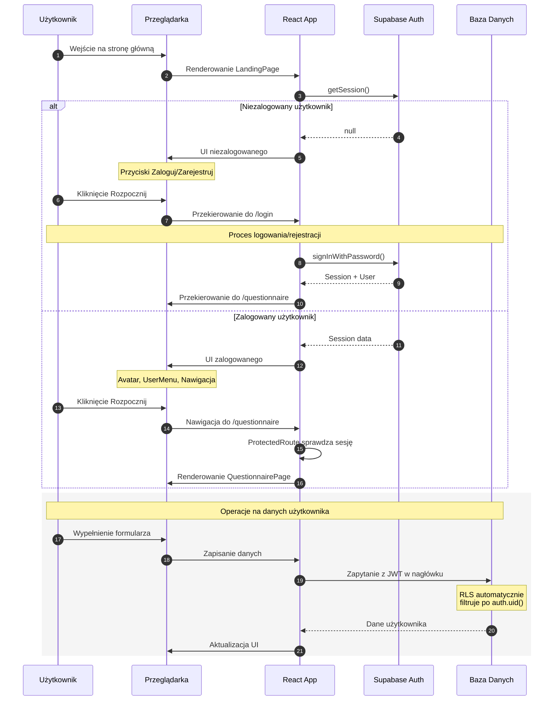

# Diagram Autentykacji - JobSwitch

## Przegląd

Niniejszy diagram przedstawia kompletny przepływ autentykacji w aplikacji JobSwitch
z wykorzystaniem Supabase Auth. Obejmuje procesy rejestracji, logowania, wylogowania,
resetowania hasła oraz zarządzania sesją.

## Aktorzy

- **Przeglądarka** - interfejs użytkownika, formularze, localStorage
- **React App** - AuthContext, ProtectedRoute, komponenty
- **Supabase Auth** - serwis autentykacji, walidacja, tokeny JWT
- **Baza Danych** - tabele auth.users oraz profiles

---

## 1. Przepływ rejestracji użytkownika

---

## 2. Przepływ logowania użytkownika

---

## 3. Przepływ wylogowania użytkownika

---

## 4. Przepływ resetowania hasła

---

## 5. Przepływ ochrony tras (Protected Routes)

---

## 6. Zarządzanie sesją i odświeżanie tokenów

---

## 7. Kompletny przepływ dostępu do aplikacji

---

## Podsumowanie

### Kluczowe elementy architektury autentykacji

| Element | Odpowiedzialność |
|---------|------------------|
| **AuthContext** | Zarządzanie stanem sesji w aplikacji |
| **ProtectedRoute** | Ochrona tras wymagających autentykacji |
| **Supabase Auth** | Walidacja, generowanie tokenów, wysyłanie emaili |
| **RLS (Row Level Security)** | Automatyczne filtrowanie danych po auth.uid() |

### Tokeny JWT

| Token | Czas ważności | Przeznaczenie |
|-------|---------------|---------------|
| access_token | 1 godzina | Autoryzacja zapytań API |
| refresh_token | 7 dni | Odświeżanie access_token |

### Zdarzenia onAuthStateChange

| Zdarzenie | Opis |
|-----------|------|
| `SIGNED_IN` | Użytkownik zalogował się |
| `SIGNED_OUT` | Użytkownik wylogował się |
| `TOKEN_REFRESHED` | Token został odświeżony |
| `USER_UPDATED` | Dane użytkownika zaktualizowane |
| `PASSWORD_RECOVERY` | Kliknięto link resetowania hasła |
