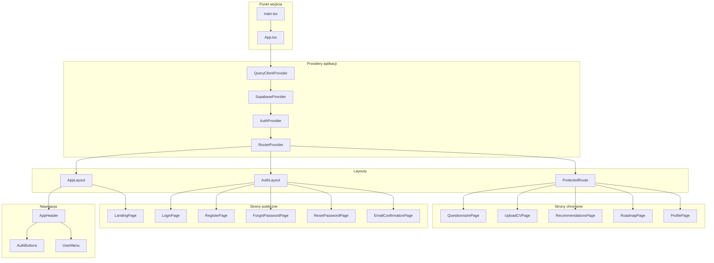
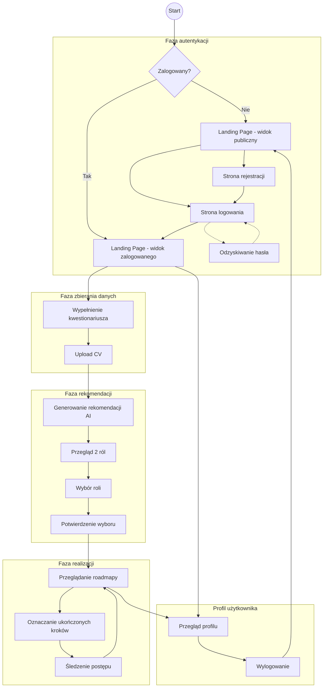
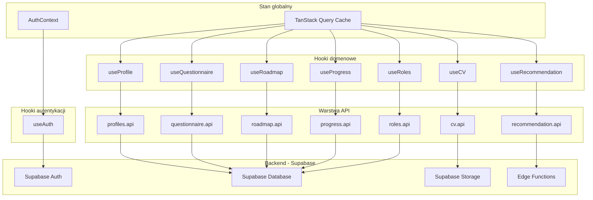
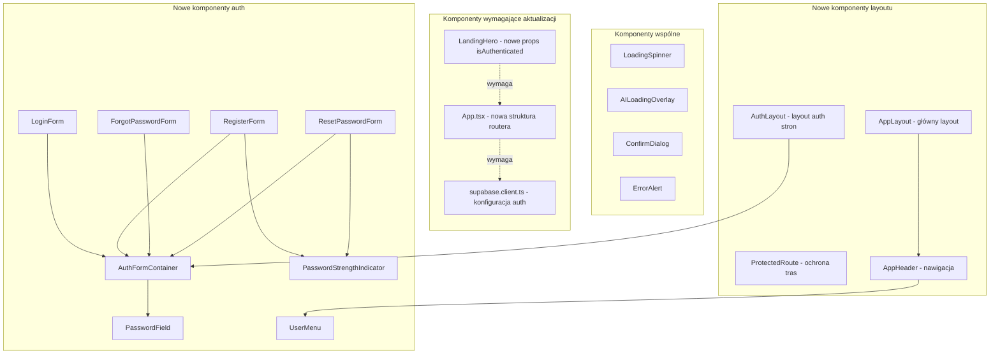
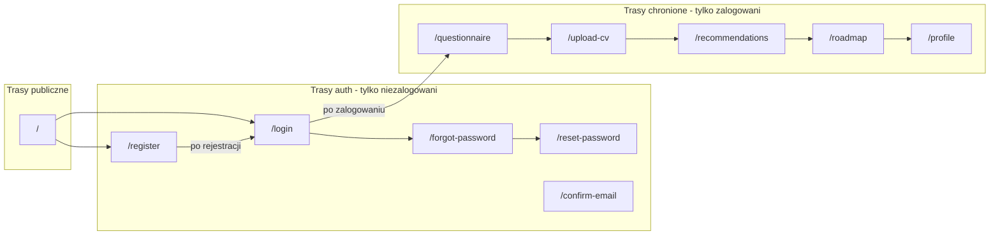

# Architektura UI - JobSwitch

Diagram przedstawia architekturę interfejsu użytkownika aplikacji JobSwitch wraz z modułem autentykacji.

<mermaid_diagram>

</mermaid_diagram>

---

## Komponenty stron

```mermaid
flowchart TD
    subgraph "Landing Page"
        LP["LandingPage"]
        HERO["LandingHero"]
        STEPS["StepsPreview"]
    end

    subgraph "Komponenty autentykacji"
        AFC["AuthFormContainer"]
        LF["LoginForm"]
        RF["RegisterForm"]
        FPF["ForgotPasswordForm"]
        RPF["ResetPasswordForm"]
        PWD["PasswordField"]
        PSI["PasswordStrengthIndicator"]
    end

    subgraph "Questionnaire Page"
        QP["QuestionnairePage"]
        QSTEP["QuestionnaireStepper"]
        QCARD["QuestionCard"]
        OQCARD["OpenQuestionCard"]
        OPTSEL["OptionSelector"]
    end

    subgraph "Upload CV Page"
        UCP["UploadCVPage"]
        DROP["CVDropzone"]
        PREV["CVPreview"]
        WARN["UploadWarningBanner"]
    end

    subgraph "Recommendations Page"
        RCP["RecommendationsPage"]
        RCARD["RoleCard"]
        RCONF["RoleConfirmationDialog"]
        RBADGE["RecommendationBadge"]
    end

    subgraph "Roadmap Page"
        RMP["RoadmapPage"]
        RTREE["RoadmapTree"]
        RNODE["RoadmapNode"]
        RPROG["RoadmapProgressHeader"]
        TBRANCH["TaskBranch"]
        TPANEL["TaskDetailsPanel"]
        TSHEET["TaskDetailsSheet"]
        TDRAWER["StepTasksDrawer"]
    end

    subgraph "Profile Page"
        PP["ProfilePage"]
        PSEC["ProfileSection"]
        SRCARD["SelectedRoleCard"]
        QANS["QuestionnaireAnswers"]
        PSUM["ProgressSummary"]
    end

    LP --> HERO
    LP --> STEPS

    AFC --> PWD
    LF --> AFC
    RF --> AFC
    RF --> PSI
    FPF --> AFC
    RPF --> AFC
    RPF --> PSI

    QP --> QSTEP
    QSTEP --> QCARD
    QSTEP --> OQCARD
    QCARD --> OPTSEL

    UCP --> DROP
    UCP --> PREV
    UCP --> WARN

    RCP --> RCARD
    RCP --> RCONF
    RCARD --> RBADGE

    RMP --> RTREE
    RMP --> RPROG
    RTREE --> RNODE
    RNODE --> TBRANCH
    TBRANCH --> TPANEL
    RMP --> TDRAWER
    TDRAWER --> TSHEET

    PP --> PSEC
    PP --> SRCARD
    PP --> QANS
    PP --> PSUM
```

<mermaid_diagram>

</mermaid_diagram>

---

## Przepływ użytkownika

<mermaid_diagram>

</mermaid_diagram>

---

## Zarządzanie stanem aplikacji

<mermaid_diagram>

</mermaid_diagram>

---

## Komponenty wspólne i zależności

<mermaid_diagram>

</mermaid_diagram>

---

## Struktura tras routera

<mermaid_diagram>

</mermaid_diagram>

---

## Legenda

| Symbol | Znaczenie |
|--------|-----------|
| `[ ]` | Komponent / Strona |
| `{ }` | Decyzja / Warunek |
| `(( ))` | Punkt startu / końca |
| `-->` | Przepływ danych / nawigacja |
| `-.->` | Przepływ opcjonalny |
| Subgraph | Grupowanie funkcjonalne |

---

## Komponenty wymagające implementacji

### Priorytet krytyczny
- `AuthProvider` / `AuthContext`
- `useAuth` hook
- `ProtectedRoute`
- `LoginPage` + `LoginForm`
- `RegisterPage` + `RegisterForm`

### Priorytet wysoki
- `PasswordField`
- `AppHeader`
- `AuthFormContainer`
- `AppLayout`

### Priorytet średni
- `ForgotPasswordPage` + `ForgotPasswordForm`
- `ResetPasswordPage` + `ResetPasswordForm`
- `PasswordStrengthIndicator`
- `UserMenu`
- `AuthLayout`

---

## Komponenty wymagające modyfikacji

| Komponent | Zakres zmian |
|-----------|--------------|
| `App.tsx` | Nowa struktura routera, zamiana DevUserProvider na AuthProvider |
| `LandingPage` | Warunkowy render dla auth/non-auth |
| `LandingHero` | Nowe props (isAuthenticated), zmiana logiki CTA |
| `supabase.client.ts` | Dodanie konfiguracji auth |
| Wszystkie komponenty używające `useDevUser` | Migracja na `useAuth` |
